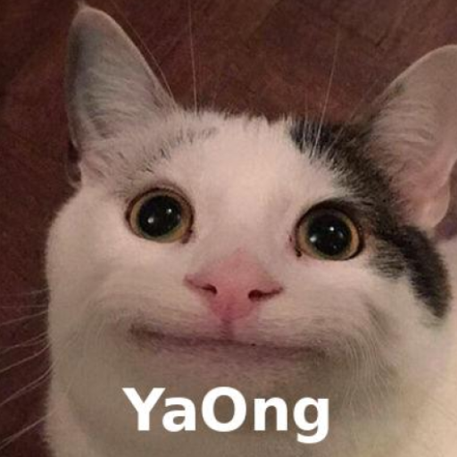

# YaOng

## Outline

 

YaOng은 연락처, 갤러리 관리와 함께 중독성 있는 터치 게임을 즐길 수 있는 앱입니다!
3개의 탭(연락처, 갤러리, 게임)으로 구성되어 있습니다.

## Team

[조성제](https://www.notion.so/madcamp/544fcc087dd04ec0b5125dc16c3cab03?pvs=4)

## Details

### BottomNavigation

화면 하단에 안드로이드에서 제공해주는`BottomNavigation`을 배치해서 다른 탭으로 넘어갈 수 있도록 구현했습니다.

### Tab 1 : 연락처

연락처를 추가, 삭제하고 원하는 연락처로 전화를 걸 수 있는 탭입니다.

<table>
  <tr>
    <td></td>
    <td></td>
    <td></td>
  </tr>
</table>

연락처는 `RecyclerView`를 이용하여 표시했습니다.

우측하단의 `FloatingActionButton`을 눌러 연락처를 추가할 수 있습니다.

연락처를 터치해서 Tab3의 게임 점수를 반영할 연락처를 선택할 수 있고, 선택한 연락처에는 고양이 사진이 표시됩니다.

연락처를 더블클릭하면 해당 연락처의 점수를 0점으로 초기화 할 수 있습니다.

`ItemTouchHelper`를 사용하여 스와이프 기능을 구현했습니다.

연락처를 오른쪽으로 스와이프하면 전화 앱으로 연결되어 해당 연락처의 번호로 전화를 걸 수 있습니다.

연락처를 왼쪽으로 스와이프하면 해당 연락처를 삭제할 것인지 물어보는 팝업창이 뜹니다.

연락처의 정보들은 `SharedPreferences`에 저장되어 앱을 껐다 켜도 앱 내부 저장소에 유지됩니다.

### Tab 2 : 갤러리

갤러리에 있는 사진을 추가, 삭제할 수 있는 탭입니다.

<table>
  <tr>
    <td></td>
    <td></td>
    <td></td>
  </tr>
</table>

사진은 `GridView`를 이용하여 표시했습니다.

우측하단의 `FloatingActionButton`을 눌러 사진을 추가할 수 있습니다.

휴대폰 갤러리 앱과 연동되어 원하는 사진을 선택해 추가할 수 있습니다.

갤러리탭의 사진을 길게 누르면 해당 사진을 삭제할 것인지 물어보는 팝업창이 뜹니다.

갤러리탭의 사진들은 `SharedPreferences`에 저장되어 앱을 껐다 켜도 앱 내부 저장소에 유지됩니다.

### Tab 3 : Meow

고양이를 클릭해서 점수를 얻는 게임을 할 수 있는 탭입니다.

`android-youtube-player` 라이브러리를 이용하여 고양이 영상을 불러왔습니다.

화면 하단에 있는 고양이를 터치하면 고양이가 입을 빠르게 여닫고 점수가 1점 오릅니다.

점수는 Tab1에서 선택한 연락처의 점수에 반영됩니다.
